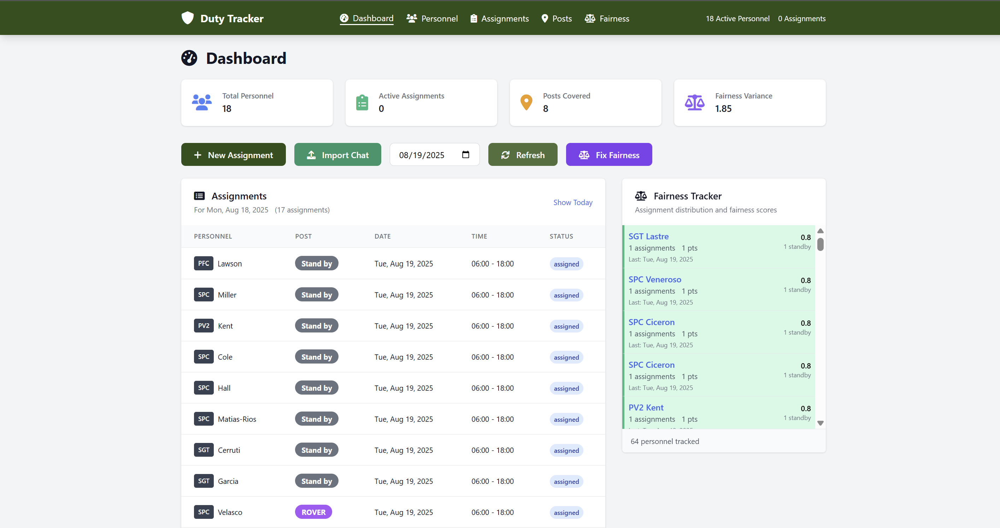
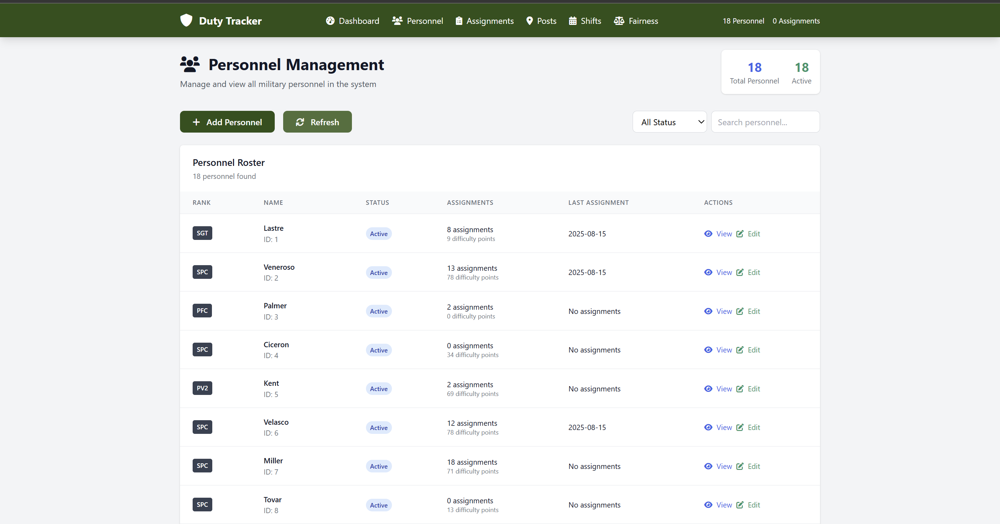
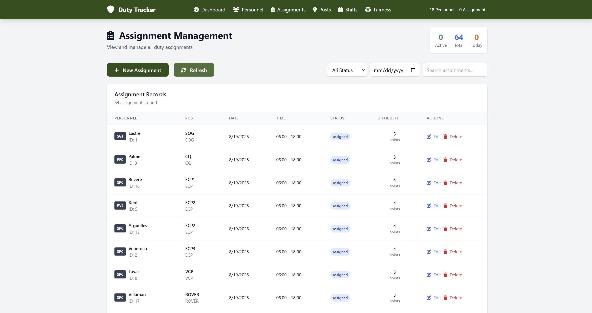
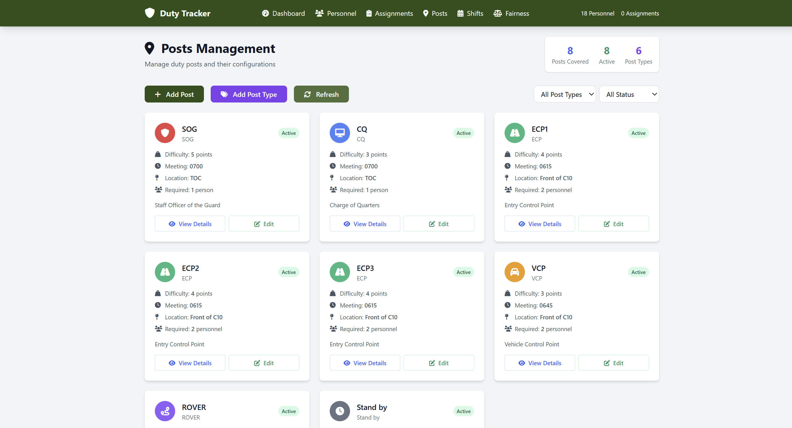
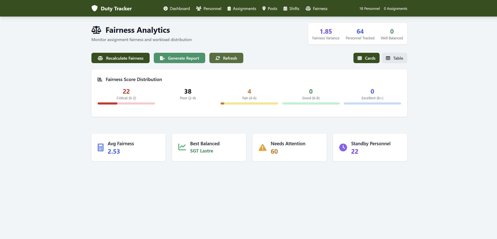

# Duty Tracker

A simple website to track who is assigned to military duty posts. See who is working, where, and when.

---

## Screenshots

- Dashboard: 
- Personnel: 
- Assignments: 
- Posts: 
- Fairness: 

---

## How to Start

1. **Install**
   - If you see `install.bat`, double-click it.
   - Or ask someone to help you run:
     ```bash
     uv sync --group dev
     ```

2. **Run**
   - If you see `start.bat`, double-click it.
   - Or ask someone to help you run:
     ```bash
     uv run uvicorn app.main:app --reload
     ```

3. **Open Website**
   - Open Chrome, Edge, or Firefox.
   - Go to: [http://localhost:8000](http://localhost:8000)

---

## How to Use

- Click the menu for Personnel, Assignments, Posts, or Fairness.
- Click "Add" or "Edit" to change things.
- Fill in the pop-up and click "Save".

---

## Problems?

- If it doesn't work, ask someone for help or contact [j4v3l](mailto:your-email@example.com).

---

## Files & Folders

```
duty-tracker/
  app/         # Main code
  static/      # Styles and scripts
  templates/   # Web pages
  tests/       # Automated tests
  screenshots/ # Your screenshots
```
